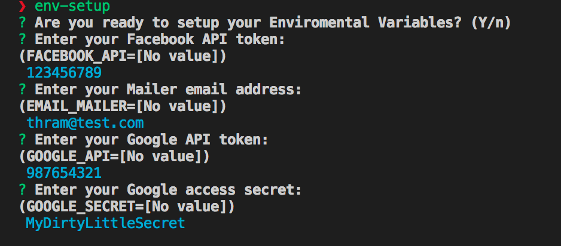

# Env-Setup

[](https://greenkeeper.io/)

#### Requirements: Node >= 8

Easy setup for production `.env` using `.env.[example|sample]` as template.

***Note: If you don't know what a `.env` file is check this package first [dotenv](https://www.npmjs.com/package/dotenv)***

The template format uses the values as the description of the variable.

### Template Example

`.env.example`

```
FACEBOOK_API=Enter your Facebook API token
EMAIL_MAILER=Enter your Mailer email address
GOOGLE_API=Enter your Google API token
GOOGLE_SECRET=Enter your Google access secret
```

### Installation

```bash
npm i -g env-setup
```

### Usage

You just run:

```bash
env-setup
```


